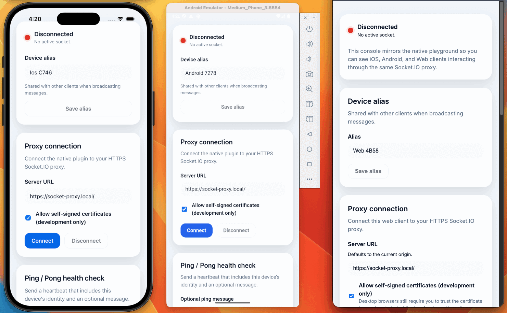

# @zenzig/capacitor-socket-io

A native Socket.IO bridge for Capacitor apps. Remove CORS headaches and talk directly to Socket.IO
servers from Android and iOS with a shared JavaScript API.

## Features

- 🔌 Native Socket.IO clients aligned with the Socket.IO 4.x protocol (Android Java client 2.1.2 / iOS Swift client 16.1.x)
- 🧵 Background thread handling so the UI never blocks during connect/emit calls
- 🔐 Debug-only trust-all SSL mode for development servers with self-signed certs
- 📡 Real-time event forwarding: subscribe once and receive everything in JavaScript
- 🌐 Web fallback that uses `socket.io-client` so your app behaves the same in the browser

## Gallery

<figure>
	
	<figcaption><strong>Cross-platform overview.</strong> The animation cycles through the native timelines, proxy console, and configuration views.</figcaption>
</figure>

## Installation

Until the package is published on npm, install it straight from this repository (pin to the
`main` branch or a specific commit/tag).

```bash
npm install github:zenzig/capacitor-socket-io#main
npx cap sync
```

Prefer working from a local clone? Run `npm pack` in this repo after `npm run build`, then install
the generated tarball in your Capacitor app (`npm install ../capacitor-socket-io/capacitor-socket-io-*.tgz`).
We will update these instructions once the plugin is available on the npm registry.

The sync step installs the native Android/iOS sources into your Capacitor project.

> Copy `.env.example` to `.env` and set `SOCKET_IO_PROXY_URL` to your HTTPS proxy so the helper
> scripts and verification commands can exercise a real Socket.IO endpoint.

## Quick start

Follow these steps to exercise the plugin using the bundled Docker proxy and the example app.

1. **Install dependencies (root):**

   ```bash
   npm install
   ```

2. **Launch the HTTPS proxy:**

   ```bash
   npm run proxy:setup -- --write-hosts
   ```

   This command:

   - starts a Caddy reverse proxy with automatic TLS certificate generation
   - updates `.env` with `SOCKET_PROXY_HOST`, `SOCKET_IO_PROXY_URL`, `VITE_SOCKET_PROXY_URL`, a detected `ANDROID_PROXY_LAN_IP`, and the matching `E2E_DEV_SERVER_HOST`
   - rewrites `/etc/hosts` (on macOS/Linux) so `socket-proxy.local` resolves to your LAN IP
   - installs the Caddy root CA on macOS for trusted HTTPS connections

   Add `--no-start` if you only want to configure `.env`, or `--host dev.example.com` to customise the endpoint. The proxy always binds to port 443 so automated tests have a consistent target.

   Once the stack is up, confirm it is healthy with `curl https://socket-proxy.local/healthz`.

   With the stack running, open [https://socket-proxy.local/](https://socket-proxy.local/) in your browser to access the web console.

3. **Build and sync the example app:**

   ```bash
   npm run example:install
   (cd example-app && npm run build && npx cap sync android ios)
   ```

4. **Run the Android demo (auto host-mapping included):**

   ```bash
   npm run test:android
   ```

   The launcher boots/targets an emulator or device, ensures `/system/etc/hosts` contains a mapping for `socket-proxy.local`, installs the app, and connects to the proxy.

   > **Note:** The example app enables "Allow Untrusted Certs" by default in development, so no manual certificate installation is required on emulators or simulators.

5. **Optional - run on iOS:**

   ```bash
   npm run test:ios
   ```

That is it - you now have a native client talking to the Socket.IO test server exposed by Docker. Keep the proxy running while iterating; when you are done, stop it with `npm run proxy:down`.

6. **Optional - run the web end-to-end suite:**

   ```bash
   npm run test:e2e
   ```

The Playwright runner bootstraps the Vite dev server, connects the browser experience to the proxy, exercises the connect/ping workflow, and captures traces for debugging.

## Testing

Automated checks assume the HTTPS proxy is available at `https://socket-proxy.local:443`. Start it with `npm run proxy:setup -- --write-hosts` (or reuse an existing run) before executing any test suites. Stop it afterwards with `npm run proxy:down`.

### Cross-platform end-to-end coverage

- `npm run test:e2e` - runs the Android JVM socket test, the iOS Swift package test, and the Playwright browser suite sequentially so every platform proves it can connect, identify, and exchange pings with the proxy.
- `npm run test:e2e:web` - executes only the Playwright flow if you want to focus on the web harness.

### Fast feedback

- `npm run lint` - runs ESLint, Prettier (check mode), and SwiftLint so TypeScript, Java, and Swift changes stay formatted and warning-free.
- `npm run test` - executes the Vitest unit suite (everything except the Playwright flow).
- `npm run test:watch` - keeps Vitest running interactively while you iterate.
- `npm run verify:web` - builds the plugin bundle to confirm the TypeScript output still ships.

### Native build verification

- `npm run verify:android` - invokes the Gradle unit tests and assembly tasks (requires the Android SDK/NDK configured on your PATH).
- `npm run verify:ios` - builds the Swift Package via `xcodebuild` to catch compile-time issues.
- `npm run verify` - runs the Android, iOS, and web verify targets sequentially.

### Native playground launchers

- `npm run test:android` - rebuilds the plugin, deploys the example app to a device/emulator, rewrites `/system/etc/hosts` with `socket-proxy.local`, and exercises the ping workflow.
- `npm run test:ios` - opens a picker for simulators, installs the example app, and connects to the proxy.

Every command above reads `.env` automatically, so keep `SOCKET_IO_PROXY_URL` and `VITE_SOCKET_PROXY_URL` pointed at `https://socket-proxy.local`.

## Self-Signed Certificate Handling

The plugin includes a **debug-only trust-all SSL mode** that allows connections to servers with self-signed or untrusted certificates during development:

- The example app enables this by default via the "Allow Untrusted Certs" checkbox
- **No manual certificate installation is required** on emulators or simulators
- In production, this mode is disabled and only properly signed certificates are accepted

This matches typical development workflows where local proxies use self-signed certs, while production environments use CA-issued certificates.

## Token-based authentication

The bundled Socket.IO upstream can require stateless JWTs before accepting a connection. Enable it by supplying one of the following environment variable sets before launching the proxy stack:

- `SOCKET_SERVER_AUTH_SECRET` - raw signing secret (recommend 32+ bytes).
- `SOCKET_SERVER_AUTH_PASSPHRASE` - human-readable passphrase that will be hashed with PBKDF2.

When authentication is disabled the server behaves exactly as before. When enabled, the middleware expects a JWT in one of three places - `socket.handshake.auth.token`, a `token` query parameter, or an `Authorization: Bearer <token>` header.

## API surface

| Method | Description |
| --- | --- |
| `connect(options?: ConnectOptions)` | Open (or reopen) a Socket.IO connection. |
| `disconnect()` | Close the current socket and release native resources. |
| `emit(options: EmitOptions)` | Send data to the server. |
| `on({ event })` | Ask the native layer to forward a specific event down to Capacitor listeners. |
| `addListener(eventName, callback)` | Subscribe to events (`connect`, custom messages, etc.). |
| `removeAllListeners()` | Clears all registered listeners in both native and web implementations. |

## Contributing

See [CONTRIBUTING.md](./CONTRIBUTING.md) and [STYLE_GUIDE.md](./STYLE_GUIDE.md).
