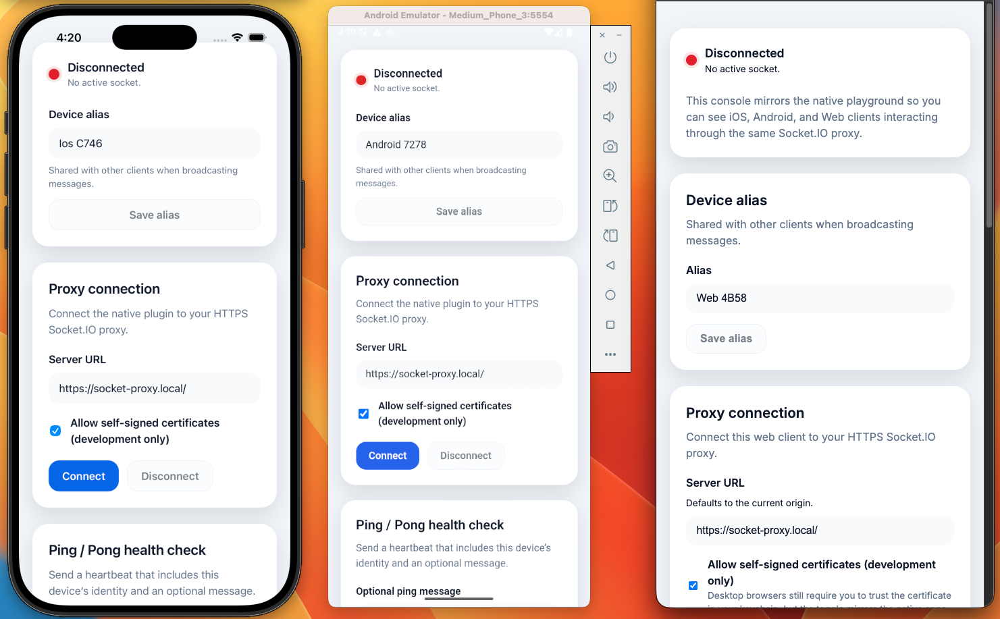
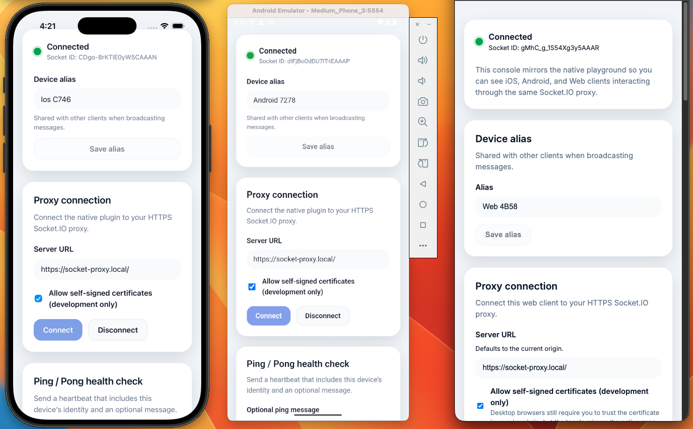
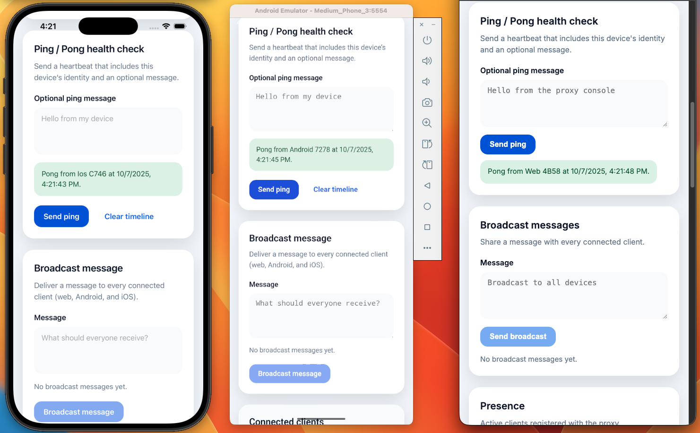
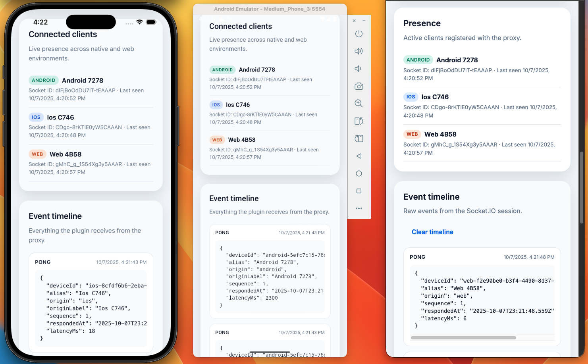
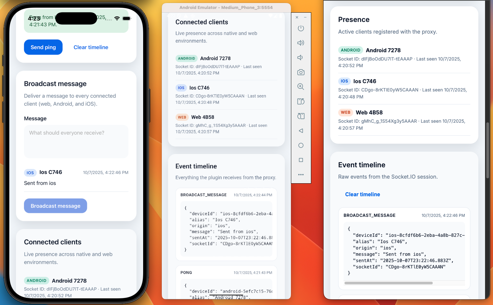
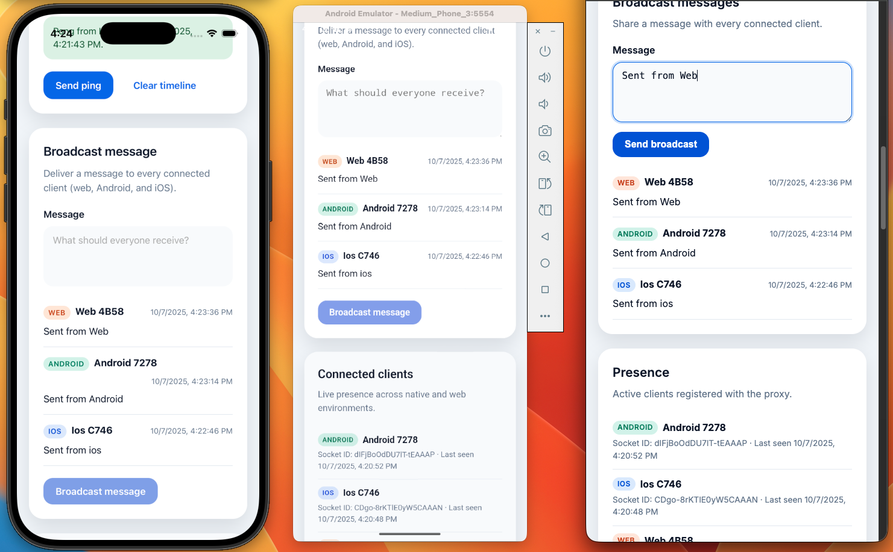

	# @zenzig/capacitor-socket-io

A native Socket.IO bridge for Capacitor apps. Remove CORS headaches and talk directly to Socket.IO
servers from Android and iOS with a shared JavaScript API.

## Features

- 🔌 Native Socket.IO clients aligned with the Socket.IO 4.x protocol (Android Java client 2.1.2 / iOS Swift client 16.1.x)
- 🧵 Background thread handling so the UI never blocks during connect/emit calls
- 🔐 Debug-only trust-all SSL mode for development servers with self-signed certs
- 📡 Real-time event forwarding: subscribe once and receive everything in JavaScript
- 🌐 Web fallback that uses `socket.io-client` so your app behaves the same in the browser

## Gallery

<figure>
	
	<figcaption><strong>Native iOS timeline.</strong> The simulator surfaces ping/pong payloads from the proxy, including device identity, origin, and measured latency.</figcaption>
</figure>

<figure>
	
	<figcaption><strong>Android broadcast and presence.</strong> The Material-styled view renders the same feed, presence roster, and timeline shared across platforms.</figcaption>
</figure>

<figure>
	
	<figcaption><strong>Proxy console.</strong> The HTTPS dashboard mirrors every Socket.IO event so you can inspect raw payloads alongside the native apps.</figcaption>
</figure>

<figure>
	
	<figcaption><strong>Three-way sync.</strong> iOS, Android, and the proxy UI stay in lockstep while broadcasting messages and presence updates.</figcaption>
</figure>

<figure>
	
	<figcaption><strong>Broadcast composer.</strong> Alias editing, ping composer, and connection status indicators make it easy to test flows end-to-end.</figcaption>
</figure>

<figure>
	
	<figcaption><strong>Proxy configuration.</strong> Toggle self-signed certificates, point at alternative hosts, and reconnect without leaving the playground.</figcaption>
</figure>

## Installation

Until the package is published on npm, install it straight from this repository (pin to the
`main` branch or a specific commit/tag).

```bash
npm install github:zenzig/capacitor-socket-io#main
npx cap sync
```

Prefer working from a local clone? Run `npm pack` in this repo after `npm run build`, then install
the generated tarball in your Capacitor app (`npm install ../capacitor-socket-io/capacitor-socket-io-*.tgz`).
We’ll update these instructions once the plugin is available on the npm registry.

The sync step installs the native Android/iOS sources into your Capacitor project.

> Copy `.env.example` to `.env` and set `SOCKET_IO_PROXY_URL` to your HTTPS proxy so the helper
> scripts and verification commands can exercise a real Socket.IO endpoint.

## Quick start

Follow these steps to exercise the plugin using the bundled Docker proxy and the example app.

1. **Install dependencies (root):**

	```bash
	npm install
	```

2. **Launch the HTTPS proxy:**

	```bash
	npm run proxy:setup -- --write-hosts
	```

	This command:

	- generates/refreshes mkcert certificates under `docker/certs/`
	- updates `.env` with `SOCKET_PROXY_HOST`, `SOCKET_IO_PROXY_URL`, `VITE_SOCKET_PROXY_URL`, and a detected `ANDROID_PROXY_LAN_IP`
	- rewrites `/etc/hosts` (on macOS/Linux) so only one entry for `socket-proxy.local` remains, then starts the Docker proxy stack detached

	Add `--no-start` if you only want to refresh certificates and `.env`, or `--host dev.example.com` to customise the endpoint. The proxy always binds to port 443 so automated tests have a consistent target—free that port first if another service is listening on it.

		With the stack running, open [https://socket-proxy.local/](https://socket-proxy.local/) in your browser to access the
		web console. It mirrors the native playground UI so you can watch iOS, Android, and web clients interact in real time.

3. **Build and sync the example app:**

	```bash
	npm run example:install
	(cd example-app && npm run build && npx cap sync android ios)
	```

4. **Run the Android demo (auto host-mapping included):**

	```bash
	npm run test:android
	```

	The launcher boots/targets an emulator or device, ensures `/system/etc/hosts` contains a single mapping for `socket-proxy.local`, installs the app, and connects to the proxy.

5. **Optional – run on iOS:**

	```bash
	npm run test:ios
	```

That’s it—you now have a native client talking to the Socket.IO test server exposed by Docker. Keep the proxy running while iterating; when you’re done, stop it with `npm run proxy:down`.

6. **Optional – run the web end-to-end suite:**

	```bash
	npm run test:e2e
	```

The Playwright runner bootstraps the Vite dev server, connects the browser experience to the proxy, exercises the connect/ping workflow, and captures traces for debugging.

> Paste any issued JWT into the **Auth token** field on the example app’s proxy card before tapping **Connect**. The playground persists the token locally, forwards it via both `handshake.auth.token` and a `token` query parameter, and notes in the event timeline whether authentication was supplied.

## Testing

Automated checks assume the HTTPS proxy is available at `https://socket-proxy.local:443`. Start it with `npm run proxy:setup -- --write-hosts` (or reuse an existing run) before executing any test suites. Stop it afterwards with `npm run proxy:down`.

### Cross-platform end-to-end coverage

- `npm run test:e2e` – runs the Android JVM socket test, the iOS Swift package test, and the Playwright browser suite sequentially so every platform proves it can connect, identify, and exchange pings with the proxy. The script auto-selects an available iOS simulator via `xcrun simctl`; set `E2E_IOS_DESTINATION` (for example `platform=iOS Simulator,name=iPhone 15 Pro,OS=17.5` or simply `platform=iOS Simulator,id=<UDID>`) if you want to override the pick. If emulators must reach the dev machine over the LAN, export `E2E_LAN_HOST` (or reuse `ANDROID_PROXY_LAN_IP`) so the Playwright dev server binds to that interface instead of loopback.
- `npm run test:e2e:web` – executes only the Playwright flow if you want to focus on the web harness.

### Fast feedbackn

- `npm run lint` – runs ESLint, Prettier (check mode), and SwiftLint so TypeScript, Java, and Swift changes stay formatted and warning-free.
- `npm run test` – executes the Vitest unit suite (everything except the Playwright flow).
- `npm run test:watch` – keeps Vitest running interactively while you iterate.
- `npm run verify:web` – builds the plugin bundle to confirm the TypeScript output still ships.

### Native build verification

- `npm run verify:android` – invokes the Gradle unit tests and assembly tasks (requires the Android SDK/NDK configured on your PATH).
- `npm run verify:ios` – builds the Swift Package via `xcodebuild` to catch compile-time issues.
- `npm run verify` – runs the Android, iOS, and web verify targets sequentially.

### Native playground launchers

- `npm run test:android` – rebuilds the plugin, deploys the example app to a device/emulator, rewrites `/system/etc/hosts` with `socket-proxy.local`, and exercises the ping workflow. Provide `ANDROID_PROXY_LAN_IP` in `.env` when the proxy listens on a LAN address.
- `npm run test:ios` – opens a picker for simulators, installs the example app, and connects to the proxy.

Every command above reads `.env` automatically, so keep `SOCKET_IO_PROXY_URL` and `VITE_SOCKET_PROXY_URL` pointed at `https://socket-proxy.local`.

## Token-based authentication

The bundled Socket.IO upstream can require stateless JWTs before accepting a connection. Enable it by
supplying one of the following environment variable sets before launching the proxy stack:

- `SOCKET_SERVER_AUTH_SECRET` – raw signing secret (recommend 32+ bytes).
- `SOCKET_SERVER_AUTH_PASSPHRASE` – human-readable passphrase that will be hashed with PBKDF2.
	- Optional: override `SOCKET_SERVER_AUTH_SALT` (defaults to `socket-proxy-auth-salt`).
- Optional claims enforcement: `SOCKET_SERVER_AUTH_ISSUER`, `SOCKET_SERVER_AUTH_AUDIENCE`,
	`SOCKET_SERVER_AUTH_CLOCK_TOLERANCE` (seconds).

When authentication is disabled the server behaves exactly as before. When enabled, the middleware
expects a JWT in one of three places—`socket.handshake.auth.token`, a `token` query parameter, or an
`Authorization: Bearer <token>` header. The decoded claims are stored on `socket.auth` so event
handlers can make authorization decisions.

### Issuing tokens for local testing

Use the same secret (or passphrase + salt) to mint short-lived tokens from any environment. Here is
an example using Node and `jsonwebtoken`:

```bash
node --input-type=module <<'NODE'
import jwt from 'jsonwebtoken';

const secret = process.env.SOCKET_SERVER_AUTH_SECRET ?? 'changeme-in-prod';
const token = jwt.sign(
	{ sub: 'dev-client', scopes: ['presence'] },
	secret,
	{
		expiresIn: '10m',
		issuer: process.env.SOCKET_SERVER_AUTH_ISSUER ?? 'socket-proxy.local',
		audience: process.env.SOCKET_SERVER_AUTH_AUDIENCE ?? 'socket-proxy-clients',
	},
);

console.log(token);
NODE
```

Pass the token to the client via the `auth` option:

```ts
import { io } from 'socket.io-client';

const socket = io('https://socket-proxy.local', {
	path: '/socket.io',
	auth: { token: process.env.SOCKET_PROXY_TOKEN },
});
```

Presence payloads now include a minimal authentication summary (subject and scopes) so you can
confirm which identity is online without exposing the full JWT contents.

The Capacitor example app mirrors this setup automatically: when the **Auth token** field is filled
in, it stores the value securely in local storage, injects it into `auth.token`, and adds a `token`
query parameter for older client compatibility.

> **Using the plugin directly:** Once the proxy is up, you can import the plugin in your own app and point `CapacitorSocketIO.connect({ url: process.env.VITE_SOCKET_PROXY_URL })` at the generated HTTPS endpoint. Remember to call `CapacitorSocketIO.on({ event })` before adding listeners for each event you care about.

## API surface

| Method | Description |
| --- | --- |
| `connect(options?: ConnectOptions)` | Open (or reopen) a Socket.IO connection. Automatically resolves with `{ status: 'connecting', url }`. |
| `disconnect()` | Close the current socket and release native resources. |
| `emit(options: EmitOptions)` | Send data to the server. Supports `data` (object), `args` (array) or a single primitive value. |
| `on({ event })` | Ask the native layer to forward a specific event down to Capacitor listeners. Call this before `addListener`. |
| `addListener(eventName, callback)` | Subscribe to events (`connect`, custom messages, etc.). Returns a `PluginListenerHandle`. |
| `removeAllListeners()` | Clears all registered listeners in both native and web implementations. |

### Option reference

`ConnectOptions` mirrors the Socket.IO client settings:

| Name | Type | Notes |
| --- | --- | --- |
| `url` | `string` | Defaults to `https://socket-proxy.local/` if omitted. |
| `options.secure` | `boolean` | Force or disable TLS. Defaults based on the URL scheme. |
| `options.reconnection` | `boolean` | Toggle automatic reconnection. |
| `options.reconnectionAttempts` | `number` | Max retry count. |
| `options.timeout` | `number` | Connection timeout (ms). |
| `options.reconnectionDelay` | `number` | Initial reconnection delay (ms). |
| `options.reconnectionDelayMax` | `number` | Maximum reconnection delay (ms). |
| `options.path` | `string` | Override the Socket.IO namespace path (default `/socket.io`). |
| `options.query` | `Record<string, string> \\| string` | Query string params for the handshake. |
| `options.auth` | `Record<string, string \| number \| boolean \| null>` | Authentication payload forwarded via `handshake.auth` (stringified when bridged to native). |
| `options.transports` | `string[]` | Transport whitelist (e.g. `['websocket']`). |
| `options.allowSelfSigned` | `boolean` | Android/iOS only. Trust-all certificates for development builds. **Rejected at runtime** for production/distribution builds. |

`EmitOptions` accepts either `data` or `args`:

```ts
await CapacitorSocketIO.emit({ event: 'chat:message', data: { body: 'hi' } });
await CapacitorSocketIO.emit({ event: 'sum', args: [1, 2, 3] });
```

## Example app

An interactive playground lives under `example-app/`. It mirrors the plugin’s API, ships with a
Socket.IO server contract test, and backs the native demo launched in the quick start. The build and
sync commands in step 3 above prepare both Android and iOS projects; rerun them whenever you change
the plugin source.

- **Run the web preview:** `npm run dev` (Vite dev server, reads `VITE_SOCKET_PROXY_URL`).
- **Rebuild after plugin edits:** `npm run build` to compile the Capacitor plugin and refresh the
	native projects.
- **Regenerate native projects:** `npx cap sync android ios` if you touch Capacitor config, add
	platforms, or upgrade dependencies.

The Android launcher (`npm run test:android`) and iOS launcher (`npm run test:ios`) both:

1. Load proxy settings from the repository root `.env`.
2. Ensure a single `socket-proxy.local` entry exists on the device/emulator by rewriting the hosts
	 file via the shared helper.
3. Install the app bundle and connect to the HTTPS proxy started earlier.

You rarely need to touch `/etc/hosts` manually now. Only follow the steps below if you are
debugging a device that prevents remounting or you are experimenting with a custom hostname/port.

```bash
adb root
adb remount
adb shell "echo '192.168.0.28 socket-proxy.local' >> /system/etc/hosts"
adb reboot
```

> **Port requirement:** Keep the proxy on port 443. The launchers, web E2E tests, and helper scripts
> all assume `https://socket-proxy.local` without an explicit port. If something else is holding onto
> 443, stop that service before running `npm run proxy:setup` again.

> **Emulator images:** Pick a *Google APIs* system image (avoid Google Play Store images) so the
> launcher can remount `/system` read/write. It boots new emulators with `-writable-system`, but
> pre-existing emulators must be restarted with that flag for the automatic host mapping to succeed.
>
> The launcher verifies the connected device with `adb getprop` before proceeding. It currently
> expects an API 36 userdebug image whose flavor string contains `sdk_gphone` (or `google_apis` as a
> secondary match—the default allows either). If you prefer a different build, set
> `ANDROID_WRITABLE_MIN_SDK`, `ANDROID_WRITABLE_BUILD_TYPE`, or `ANDROID_WRITABLE_FLAVOR` in `.env`
> to relax the constraints.

### Testing with a TLS Socket.IO proxy

Capacitor’s WebView inherits the same web security model as a browser, so proper end-to-end testing
requires a Socket.IO server that is reachable via HTTPS. We intentionally avoid shipping a hard-coded
endpoint—bring (or stand up) your own proxy instead:

1. Choose a hostname for your test environment (for example `socket-proxy.local`) and generate a
	trusted certificate with [mkcert](https://github.com/FiloSottile/mkcert) or your preferred PKI.
2. Stand up a Socket.IO server (Node, Phoenix, etc.) on an internal port such as
	`http://localhost:4000`.
3. Place an HTTPS reverse proxy in front of it (Nginx, Caddy, Traefik) that terminates TLS with your
	certificate and forwards to the upstream Socket.IO server.
4. Import the certificate authority into your Android emulator/iOS simulator or real devices so they
	trust the proxy.
5. Point the plugin, example app, and automated tests at the proxy hostname. The repository’s
	scripts read from `.env`, so update `SOCKET_IO_PROXY_URL` (for helper scripts) and
	`VITE_SOCKET_PROXY_URL` (for the example app) accordingly.

See [`docs/testing-with-proxy.md`](./docs/testing-with-proxy.md) for a walkthrough that includes
`mkcert` commands, sample proxy configuration, and extra tips for CI environments.

### Certificate pinning & production guidance

- **Never rely on `allowSelfSigned` in production.** The plugin enforces this at runtime and will
	throw if a release build attempts to enable it.
- Adopt one of the following strategies in production builds:
	- Use certificates issued by a trusted public CA (Let’s Encrypt, DigiCert, etc.).
	- Pin the proxy’s certificate chain or public key using the platform facilities (e.g. Android
		Network Security Config, iOS ATS with `NSURLSession` delegate or configuration profiles).
- When pinning, prefer **SPKI/public-key pinning** over full certificate pinning to tolerate routine
	renewals. Rotate pins alongside certificate rollouts.
- Keep certificates short-lived and automate renewals. When pinning, ship overlapping pins to avoid
	downtime during rotation.

### Client versions & compatibility

| Platform | Package | Version | Notes |
| --- | --- | --- | --- |
| Android | `io.socket:socket.io-client` | `2.1.2` | Compatible with Socket.IO server 4.x. Excludes bundled `org.json` to avoid conflicts. |
| iOS | `Socket.IO-Client-Swift` | `16.1.1` | Aligned with Socket.IO server 4.x. Distributed via SwiftPM and CocoaPods. |
| Web | `socket.io-client` | `^4.x` | Pulled indirectly through bundlers when using web fallback. |

We track upstream releases and bump these dependencies alongside major server protocol updates.
Breaking changes will be called out in the changelog together with migration steps.

### Run the bundled proxy stack

For a quick bootstrap, the repository includes a Docker Compose stack under `docker/`. The fastest
path is:

```bash
npm run proxy:setup -- --write-hosts
```

The setup script checks for mkcert, generates `docker/certs/socket-proxy.pem`, normalises `.env`,
rewrites `/etc/hosts` so only one entry for `socket-proxy.local` remains, and starts the containers
detached. Ensure the Docker daemon is running beforehand. Prefer to run steps manually (or on a host
without Docker)? Append `--no-start` to skip launching the containers, and start them later with
`npm run proxy:up`. Need a different hostname? Add `--host dev.example.com`. The proxy always binds
to port 443; if that port is in use, stop the conflicting service before rerunning setup. Skip the
hosts rewrite with `--no-write-hosts` if you are managing entries yourself.

The stack exposes HTTPS on port 443 and self-hosts the upstream
Socket.IO test server. Shut it down with `npm run proxy:down` and watch logs with
`npm run proxy:logs`.

## Generate an AI-ready repository snapshot

Want to reason about the whole codebase with an LLM? We ship a pre-tuned [Repomix](https://repomix.com/) setup so you can bundle the interesting bits without dragging binaries and build artefacts along for the ride.

```bash
npx repomix@latest
```

The command reads `repomix.config.json` plus `.repomixignore` and emits `repomix-output.xml` in the repository root. The configuration keeps:

- the Capacitor plugin source under `src/`, `android/`, and `ios/`
- the example app (`example-app/`) and Docker proxy (`docker/`)
- docs, scripts, and CI workflows for extra context

while skipping generated build directories, compiled assets, TLS certificates, and other sensitive material. The default run also scans for secrets before writing the bundle. Share the XML with your AI assistant of choice to give it full project awareness.

## Updating the generated docs

The README API table above is maintained manually for clarity. If you prefer the automatic docgen
output, update the JSDoc comments in `src/definitions.ts` and run:

```bash
npm run docgen
```

This regenerates the `README.md` API section and `dist/docs.json` based on the current plugin
signature.
